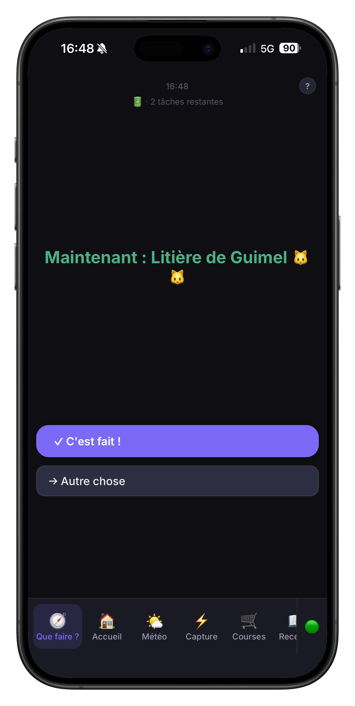
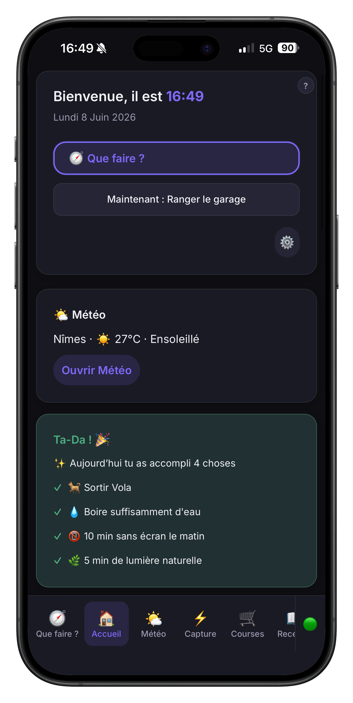
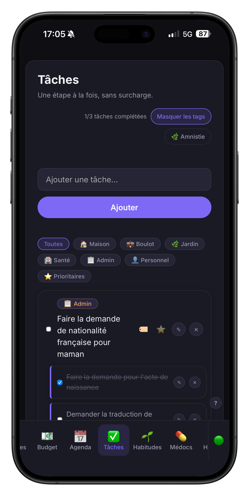
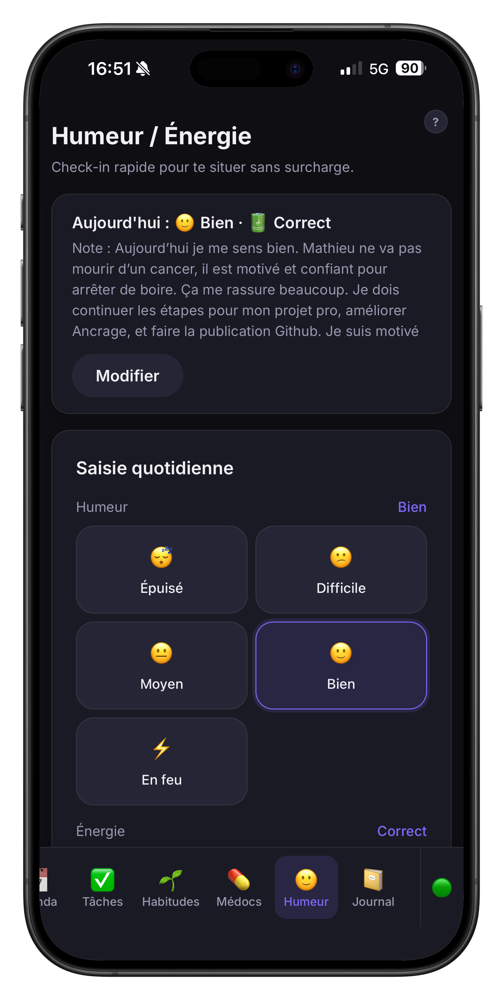
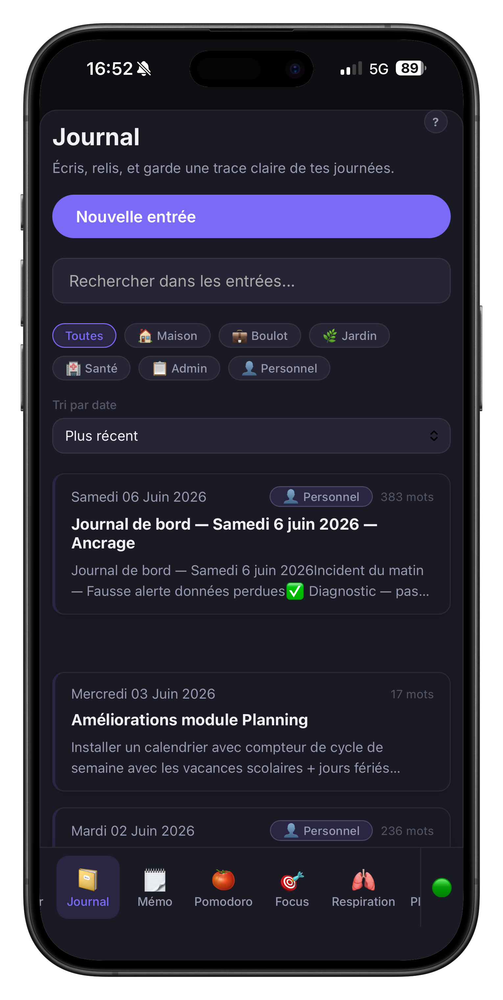
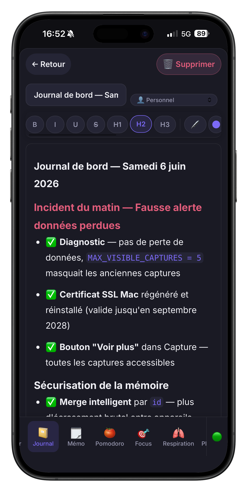
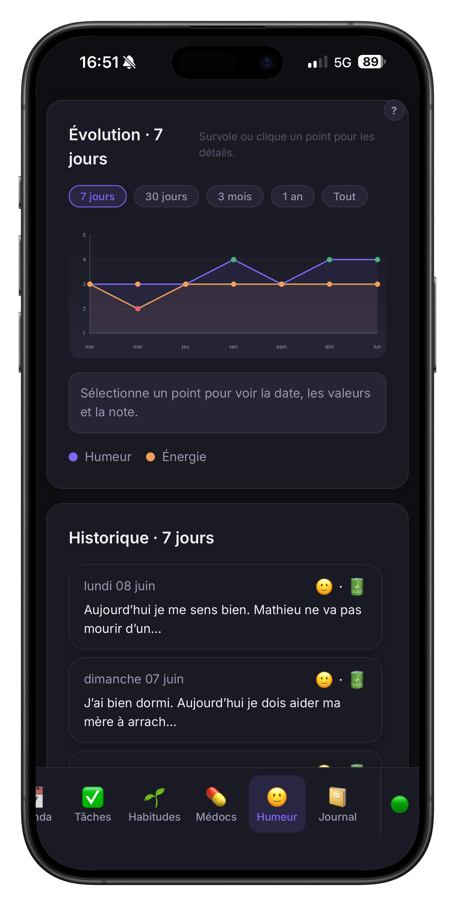
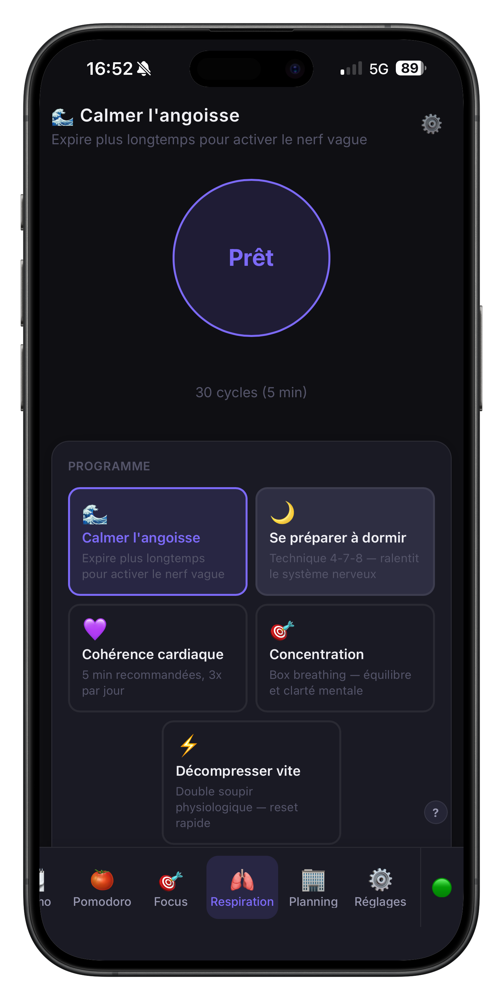
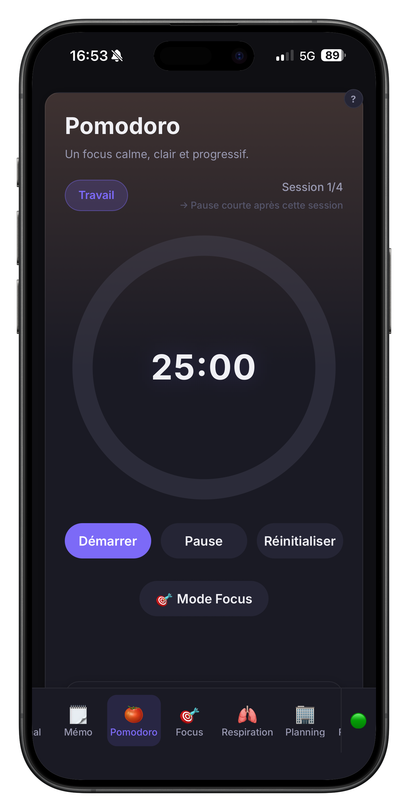
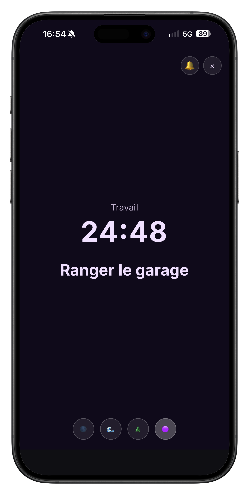

# ⚓ Ancrage

> *"Fatigué que ton cerveau tourne en boucle sans savoir par où commencer ?  
> Ancrage te dit quoi faire. Une seule chose. Maintenant."*

**Ancrage est une application de productivité conçue pour les cerveaux TDAH** — pas pour les cerveaux neurotypiques qui veulent plus d'organisation. Pour les cerveaux qui oublient, qui procrastinent, qui culpabilisent, qui se noient dans les listes.

Elle s'adapte à toi. Pas l'inverse.

<div align="center">

**[▶️ Essayer la démo](https://ancragedemo.netlify.app)**
&nbsp;&nbsp;•&nbsp;&nbsp;
*Données locales à ton navigateur — rien n'est synchronisé*

</div>

---

## Ce que ça change vraiment

Les apps de productivité classiques supposent que tu sais déjà quoi faire, que tu n'oublies pas, et que tu ne te sens pas coupable quand tu rates une journée. **Ancrage part du principe inverse.**

### 🧭 "Que faire ?" — l'anti-to-do-list

Tu ouvres l'app. Tu vois **une seule chose à faire** — choisie selon ton énergie du moment et l'heure de la journée. Pas de liste. Pas de choix paralysant. Juste : là, maintenant, fais ça.

Si ton énergie est au plus bas, l'app te propose 5 minutes de respiration plutôt qu'une tâche lourde. C'est de la neurologie appliquée, pas du design d'interface.

### 🌿 L'Amnistie

Tu n'as pas ouvert l'app depuis 3 jours. Au lieu de t'accueillir avec une liste rouge de tâches en retard, Ancrage te propose gentiment :

> *"La semaine a été chargée ? On archive tout et on repart de zéro."*

Pas de culpabilité. Pas de punition. Juste un nouveau départ.

### 🎉 Le Ta-Da !

Au lieu d'afficher ce qu'il te reste à faire, le tableau de bord célèbre **ce que tu as accompli aujourd'hui**. L'inverse d'une to-do list — calibré pour un cerveau TDAH qui souffre d'amnésie des réussites.

### 🔇 Modules désactivables

Trop de modules ? Désactive ceux dont tu n'as pas besoin. Ils disparaissent complètement de la navigation. Moins de bruit visuel = moins de charge cognitive.

---

## Aperçu

<div align="center">

### Les essentiels






### L'expérience






### Autres modules




</div>

---

## Les modules

| Module | Ce que ça fait | Problème TDAH adressé |
|--------|---------------|----------------------|
| 🧭 **Que faire ?** | UNE action selon ton énergie + l'heure | Paralysie décisionnelle |
| 🏠 **Accueil** | Tableau de bord personnalisable | Vue d'ensemble sans surcharge |
| ✅ **Tâches** | Tâches + sous-tâches, Amnistie | Mémoire de travail |
| 🗒️ **Mémo** | Carnet de référence par sections | Perte d'infos importantes |
| 📅 **Agenda** | Vues mois/semaine/jour, rappels | Time blindness |
| 🍅 **Minuterie** | Sessions courtes avec pauses | Difficulté de concentration |
| 😊 **Humeur** | Check-in quotidien, graphiques | Dysrégulation émotionnelle |
| 🌱 **Habitudes** | Routines sans punition | Maintien des routines |
| 📓 **Journal** | Éditeur riche avec formatage | Expression, traitement émotionnel |
| ⚡ **Capture rapide** | Vide-tête en 2 secondes | Mémoire de travail — le seau percé |
| 🎯 **Focus** | Mode plein écran, ambiances | Distractibilité |
| 🛒 **Courses** | Liste + budget en temps réel | Oubli en magasin |
| 💶 **Budget** | Finances + projets d'épargne | Impulsivité financière |
| 📖 **Recettes** | Recettes TDAH-friendly | Difficulté à décider quoi manger |
| 🫁 **Respiration** | 5 programmes guidés | Régulation émotionnelle |
| 💊 **Médicaments** | Rappels doux sans culpabilité | Oubli du traitement |
| 🌤️ **Météo** | Prévisions du jour | Planification |

---

## Philosophie

> *Se réparer. Réparer son environnement. Réparer le monde.*

Chaque décision de design suit les mêmes principes :

- **Une seule priorité** à la fois — jamais de système A/B/C complexe
- **Pas de punition** si tu rates un jour — les compteurs ne repartent pas à zéro
- **Capture en 2 secondes** — note d'abord, trie après
- **Tes données restent chez toi** — tout tourne sur ton propre matériel, rien dans le cloud

---

## Installation

Ancrage tourne sur un **Raspberry Pi** chez toi — tes données ne quittent jamais ton domicile.

👉 **[Lire le guide d'installation complet](INSTALL.md)**

Le guide couvre : Mac, Windows, iPhone, Android — pas à pas, avec captures d'écran.

> 💡 Le Pi consomme ~5W en fonctionnement — environ 5€/an d'électricité.

```bash
# Une fois installé, déployer une mise à jour
git pull && npm install && ./deploy.sh
```

---

## Contribuer

**Tu n'as pas besoin de savoir coder pour contribuer.**

Ancrage est développé par vibe coding — en décrivant chaque fonctionnalité en langage naturel à une IA. Si tu as une idée de module et un téléphone pour tester, tu peux contribuer.

👉 **[Lire le guide de contribution](CONTRIBUTING.md)**

---

## Stack technique

```
Frontend  : HTML/CSS/JavaScript vanilla + Vite
Stockage  : localStorage (instantané) + PocketBase (sync)
Serveur   : Nginx sur Raspberry Pi 5
Réseau    : Tailscale (VPN chiffré)
Tests     : smoke tests (intégrité structurelle des 20 modules) + tests unitaires Vitest (storage + mood)
```

Les décisions architecturales sont documentées dans [docs/decisions/](docs/decisions/).

---

## Licence

[MIT](LICENSE) — Cédric Bosch, 2026  
Développé avec ❤️ et [Claude](https://claude.ai) + [Cursor](https://cursor.sh)
